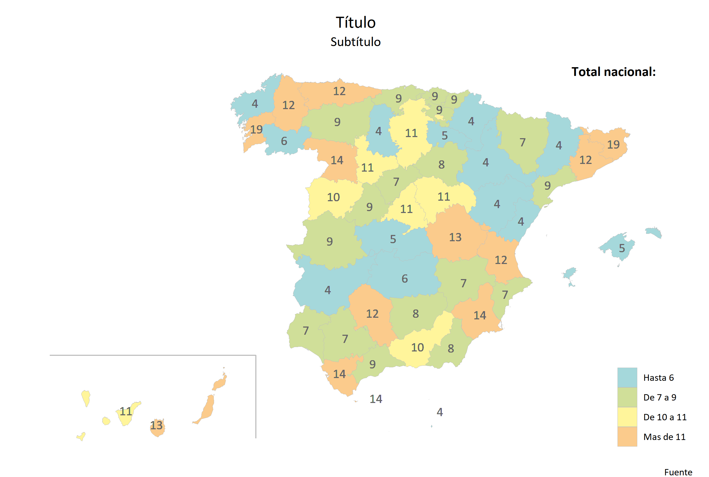
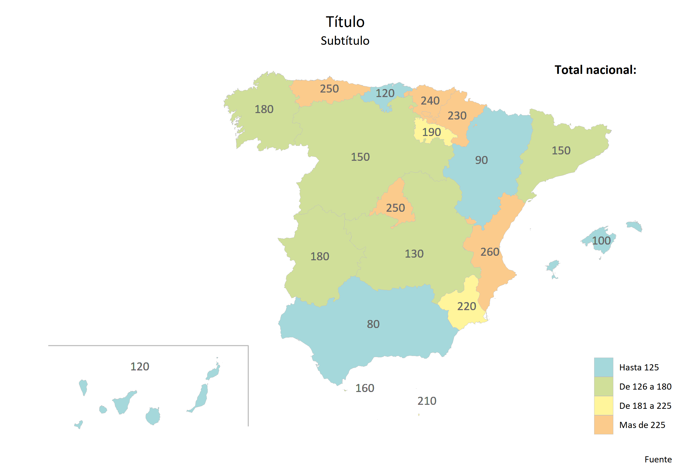

El objetivo de este proyecto es automatizar la generación de mapas de España por comunidad autónoma o provincia con R y ggplot2 a partir de un conjunto con datos en formato csv. 

Estos datasets se deben estructurar en el formato establecido en los ficheros data_ccaa y data_prov. Es decir, que necesitan contener los nombres de las comunidades autónomas y provincias tal cual aparecen en esos archivos, los nombres de variables en columnas y los valores de cada variable en filas.

Para facilitar el uso por parte de usuarios no familiarizados con R, se incorpora una hoja de Excel auxiliar que da como resultado el código a introducir en el programa que genera los mapas. Los usuarios que sepan utilizar R pueden escribir el código directamente en el script, pero si son muchos mapas la hoja auxiliar puede facilitar el trabajo.

El código generado por la hoja de Excel auxiliar o programado a mano se ejecuta en el script_plot, que a su vez ejecuta script_base. El motivo de crear dos script separados es para que resulte más sencillo para el usuario final. De esta forma no tiene que ver todas las líneas de código que están empaquetadas en las funciones ```map_prov``` y ```map_ccaa```.

El resultado final son una serie de mapas en formato png que se almacenan en la carpeta que establezcamos.

# Ejemplos de uso

Para hacer un mapa por provincias

```
map_prov('variable1','Título','Subtítulo','Fuente','Total nacional: ','content/images/prov.png')
```

<p align="center">

</p>

Para hacer un mapa por comunidades autónomas

```
map_ccaa('variable2','Título','Subtítulo','Fuente','Total nacional: ','content/images/ccaa.png')
```

<p align="center">

</p>
